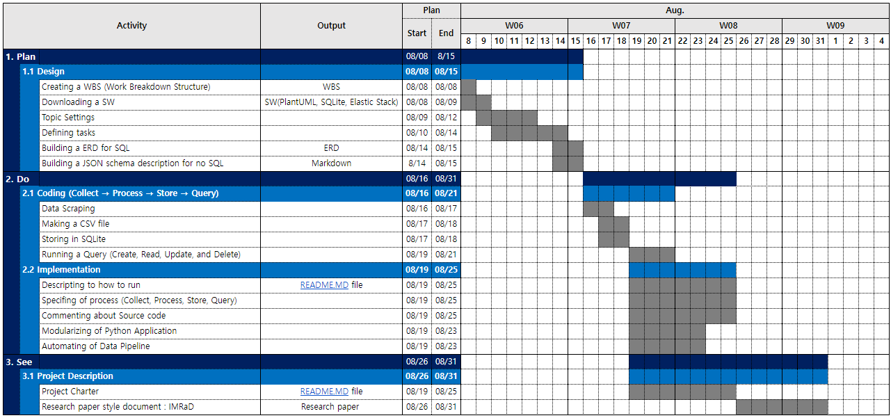

# Project Description 
***

### 1. Project Name 
* Creating freight indexes information
 

### 2. Goals
* Creating oceanfreight/airfreight indexes information required for forwarding pricing tasks, such as establishing international freight strategies and profit models
 

### 3. Problem Statement
* Forwarding refers to the business of arranging the logistics of import/export cargo by using the logistics facilities and equipment of the supplier in the name of the forwarding company at the request of the consumer. The consumer will want to charge the forwarding company for logistics costs at the lowest possible price, and the supplier will want to collect the logistics and transportation costs at the highest possible price. At this point, the need for the forwarding company's pricing task arises. That is, the person in charge of pricing is responsible for establishing and implementing strategies for air and ocean international freight rates, contacting airlines and shipping companies to identify trends, and securing supply space through seasonal cargo capacity management. However, in the case of 'Freight indexes', one of the main information needed for Pricing tasks, there is an inconvenience of accessing and checking each subject's site to check indexes information because there is more than one index designated as an international standard. 
* Freight indexes
   * Ocean indexes
      * BDI(Baltic Dry Index) : A shipping and trade index created by the London-based Baltic Exchange. It measures changes in the cost of transporting various raw materials, such as coal and steel.
      * CCFI(China Containerized Freight Index) : An index that reflects short-term and long-term contract fares throughout China. It is evaluated as an index that objectively reflects the global container transportation market and a major index representing China's shipping market
      * SCFI(Shanghai Containerized Freight Index) : An index that reflects the fluctuation of spot freight rates on export container transport market from Shanghai
      * HRCI(Howe Robinson Container Index) : The container market for charter (rent a boat for a day) and is representative of the ship broker Howe Robinson & Co.
   * Air indexes
      * BAI(Baltic Air Freight Indices) : An index that reflects weekly transactional rates for general cargo as provided by freight forwarders.
 

### 4. Project Scope
* 
 

### 5. Benefits
* A deliberable of project is expected to be a database file for a total of 5 freight indexes data.
* The efficiency of pricing tasks will be increased as indexes data can be viewed and managed in one integrated channel.
 

### 6. Project Team : Hyuncheol Ryu(PM)
 

### 7. Schedule 

  

# Getting Started
***
In order to run the code in [src](link) and [DB](link), you'll need the following software and python packages.

### Prerequisites
* //설명 [Visual Studio](https://www.guru99.com/download-install-visual-studio.html)
* //설명 [PlantUML](https://se-education.org/addressbook-level4/UsingPlantUml.html)
* //설명 [Jupyter](https://jupyter.readthedocs.io/en/latest/install.html)
* //설명 [SQLite](https://www.tutorialspoint.com/sqlite/sqlite_installation.htm)
* //설명 [Chrome Driver](https://chromedriver.chromium.org/downloads) Download the same version of Google Chrome you are using

### Installing the python package
* Pandas
    * //설명
<pre><code>pip install pandas</code></pre>
 

* BeautifulSoup
    * //설명
<pre><code>pip install BeautifulSoup4</code></pre>
 

* Html_table_parser
    * //설명
<pre><code>pip install Html_table_parser</code></pre>
 

* Selenium
    * //설명
<pre><code>pip install Selenium</code></pre>
 

* Sqlite3
    * //설명
<pre><code>pip install Sqlite3</code></pre>

### Files
1. src/ 
    1. [scraping&processing_data](./src/scraping&processing_data.ipynb) : Code that scrapes freight indexes for each website, transforms table of indexes data into a standardized form, and saves it as a csv files
    2. [storing_data]() : Code to Import csv files generated by (1-A) into SQLite database
    3. [querying_data ]() : Code to query from the database
    
    
2. Data/ 
    * [table_freights]() : A csv file containing information about the entire freight indexes, generated by (1-A)
    * [table_oceanfreight]() : A csv file containing information about ocean freight indexes, generated by (1-A)
    * [table_airfreights]() : A csv file containing information about air freight indexes, generated by (1-A)
    
    
3. DB/ 
    * [ERD_Freight.swift]() : Structural diagram that graphically depicts entity relationships about freight information
    * [Freight.db]() : Database file for freight information generated by (2-A)
    
4. [Research Paper]()
  

### Usage
1. Scrap data and save as csv files via (1-A) code
2. After creating the database file, import the CSV files into SQLite via (2-A) code
3. Run a query(select, update, delete), if necessary via (3-A) 
  

# References
***
The follwing are the sites I referred for scraping the freight indexes
* BAI (https://dashboard.tacindex.com/dashboard)
* BDI (https://kr.investing.com/indices/baltic-dry-historical-data)
* CCFI (https://www.kcla.kr/web/inc/html/4-1_2.asp)
* SCFI (https://www.tradlinx.com/freight-index)
* HRCI (https://www.ksg.co.kr/shippingGraph/hrci_graph.jsp)
