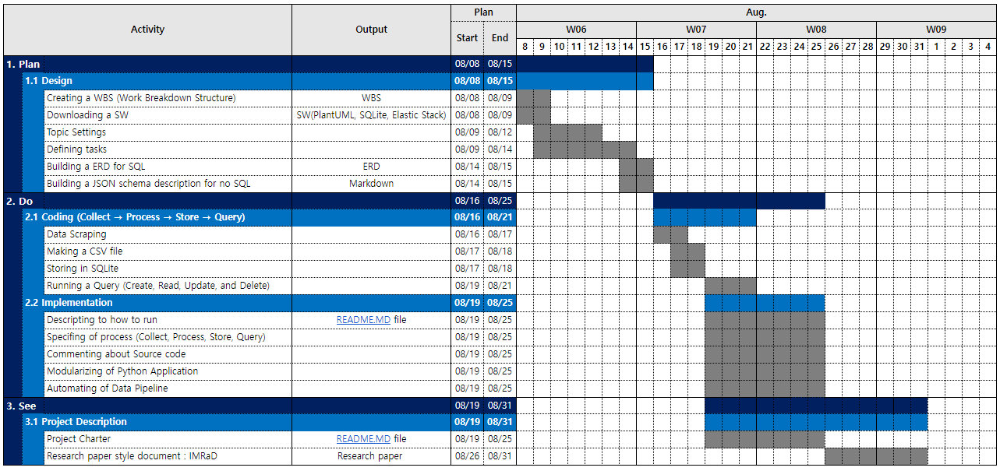

# Project Description 
***

### 1. Project Name 
* Creating freight indexes information
 

### 2. Goals
* Creating oceanfreight/airfreight indexes information required for forwarding pricing tasks, such as establishing international freight strategies and profit models
 

### 3. Problem Statement
* Forwarding refers to the business of arranging the logistics of import/export cargo by using the logistics facilities and equipment of the supplier in the name of the forwarding company at the request of the consumer. The consumer will want to charge the forwarding company for logistics costs at the lowest possible price, and the supplier will want to collect the logistics and transportation costs at the highest possible price. At this point, the need for the forwarding company's pricing task arises. That is, the person in charge of pricing is responsible for establishing and implementing strategies for air and ocean international freight rates, contacting airlines and shipping companies to identify trends, and securing supply space through seasonal cargo capacity management. However, in the case of 'Freight indexes', one of the main pieces of information needed for Pricing tasks, there is an inconvenience of accessing and checking each subject's site to check index information because there is more than one index designated as an international standard. 
* Freight indexes
   * Ocean indexes
      * BDI(Baltic Dry Index) : A shipping and trade index created by the London-based Baltic Exchange. It measures changes in the cost of transporting various raw materials, such as coal and steel.
      * CCFI(China Containerized Freight Index) : An index that reflects short-term and long-term contract fares throughout China. It is evaluated as an index that objectively reflects the global container transportation market and a major index representing China's shipping market
      * SCFI(Shanghai Containerized Freight Index) : An index that reflects the fluctuation of spot freight rates on export container transport market from Shanghai
      * HRCI(Howe Robinson Container Index) : The container market for charter (rent a boat for a day) and is representative of the ship broker Howe Robinson & Co.
   * Air indexes
      * BAI(Baltic Air Freight Indices) : An index that reflects weekly transactional rates for general cargo as provided by freight forwarders.
 

### 4. Project Scope

 

### 5. Benefits
* A deliverable of the project is expected to be a database file for a total of 5 freight indexes data.
* The efficiency of pricing tasks will be increased as index data can be viewed and managed in one integrated channel.
* By storing an index for each web page in the database, it becomes possible to develop models and strategies using past data in the future.
 

### 6. Project Team : Hyuncheol Ryu(PM)
 

### 7. Schedule

  

# Getting Started
***
To run the code in [src](link) and [DB](link), you'll need the following software and python packages.

### Prerequisites
* [PlantUML](https://se-education.org/addressbook-level4/UsingPlantUml.html) is an open-source project to quickly write diagrams and is a necessary SW for ERD design.
* [Visual Studio](https://www.guru99.com/download-install-visual-studio.html) provides an environment where you can check UML by writing the code.
* [Jupyter](https://jupyter.readthedocs.io/en/latest/install.html) is a web-based interactive computing platform that allows you to write and execute python code in a web browser. Besides Jupyter, it doesn't matter if it's a program that can execute python code.
* [SQLite](https://www.tutorialspoint.com/sqlite/sqlite_installation.htm) is a database management system such as MySQL or PostgreSQL, but it is a relatively light database that is used in applications rather than servers.
* [Chrome Driver](https://chromedriver.chromium.org/downloads) is a file that allows you to control the chrome browser, and is a necessary file when using the Selenium package. You need to download the same version of the chrome driver as your chrome, and put it where the Python file is after downloading.
 

### Installing the python package
To install the package, you need to run the command below in the command line.

* BeautifulSoup
  * It is a python package for parsing HTML and XML documents 
<pre><code>pip install BeautifulSoup4</code></pre>
 

* Selenium
  * It is a package needed to scrape data created dynamically by javascript. This is a necessary package because this is the case for web pages with BDI, SCFI, and BAI index information.
<pre><code>pip install Selenium</code></pre>
 

* Html_table_parser
  * It is a package that parses tables in HTML.
<pre><code>pip install Html_table_parser</code></pre>
 

* Pandas
  * It is used to convert index data scraped by web pages into a data frame.
<pre><code>pip install pandas</code></pre>
 
  
* Sqlite3
  * You can import the CSV file directly from 'DB Browser for SQLite', but if you use the sqlite3 package in python, you can import the CSV file into the DB file of SQLite and run a query.
<pre><code>pip install Sqlite3</code></pre>
 

* Datetime
  * In the case of the BAI index, since there is raw data with no date input, it is necessary to input the date using the DateTime package in the process of converting the scraped raw data into a standardized form.
<pre><code>pip install Datetime</code></pre>
 

* Time
  * We manipulate the selenium package through commands. For example, if you search for 'driver.get('https://pythondocs.net')', Python signals selenium, and selenium signals the browser to move the URL. The browser sends a signal to show the webpage to the pythondocs server, and pythondocs.net receives the signal and sends the webpage information in the language of HTML, CSS, and JavaScript to my browser. My browser converts the received language into a screen that people can see and displays it on the browser screen. This is where the time difference comes into play. If the driver.get(‘https://pythondocs.net’) command is executed and the next command is executed before data is received from the server, the code will not work properly. Therefore, waiting time is required to receive data, and there are three methods in Selenium for this. It is to use one of the commands 'time.sleep', implicitly wait, or explicitly wait. The time package is a package required to use the 'time.sleep' command.
<pre><code>pip install Time</code></pre>
 

### Files
1. src/ 
    1. [scraping&processing_data](./src/scrapping&processing_data.ipynb) : Code that scrapes freight indexes for each web page, transforms table of indexes data into a standardized form, and saves it as a CSV files
    2. [storing_data](./src/storing_data.ipynb) : Code to Import CSV files generated by (1-A) into SQLite database
    3. [querying_data](./src/querying_data.ipynb) : Code to query from the database
    4. [CSV_to_JSON&MD](./src/CSV_to_JSON&MD.ipynb) : Code to convert CSV file to JSON and MD file
    
2. Data/ 
    * [table_freights](./Data/table_freights.csv) : A csv file containing information about the entire freight indexes, generated by (1-A)
    * [table_oceanfreight](./Data/table_oceanfreight.csv) : A csv file containing information about ocean freight indexes, generated by (1-A)
    * [table_airfreight](./Data/table_airfreight.csv) : A csv file containing information about air freight indexes, generated by (1-A)
    
    
3. DB/ 
    * [ERD_Freight.swift](./DB/ERD_Freight.swift) : Structural diagram that graphically depicts entity relationships about freight information
    * [Freight.db](./DB/Freight.db) : Database file for freight information generated by (2-A)
    
4. [Research Paper](./Research Paper.ppt)
  

### Usage
1. Scrap data and save it as CSV files via (1-A) code
2. After creating the database file, import the CSV files into SQLite via (2-A) code
3. Run a query(select, update, delete), if necessary via (3-A) 
  

# References
***
The following are the sites I referred to for scraping the freight indexes
* BAI (https://dashboard.tacindex.com/dashboard)
* BDI (https://kr.investing.com/indices/baltic-dry-historical-data)
* CCFI (https://www.kcla.kr/web/inc/html/4-1_2.asp)
* SCFI (https://www.tradlinx.com/freight-index)
* HRCI (https://www.ksg.co.kr/shippingGraph/hrci_graph.jsp)
